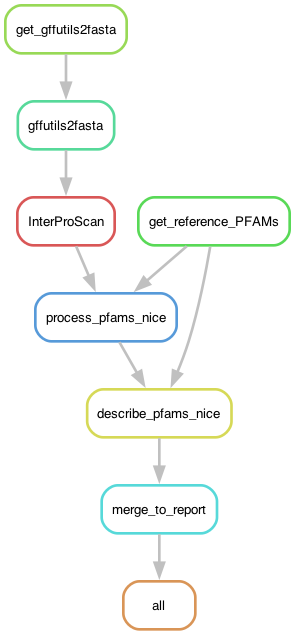

# Running InterProScan on a given *Podospora* proteome

Produce domain annotations of an input proteome using InterProScan. In this case, the focus is *Podospora* strains.

## Building the environment

The biggest difficulty for this pipeline is the installation of [InterProScan](https://interproscan-docs.readthedocs.io/en/v5/) itself. However, because I only really need the pfam annotation (`-appl Pfam`), there is no need to do complicated things, like fixing the "Match Lookup Service".

I created a [pixi](https://pixi.prefix.dev/latest/workspace/environment/) environment to have the requirements. A similar environment could be created just with [conda](https://docs.conda.io/projects/conda/en/latest/user-guide/tasks/manage-environments.html).

For installing InterProScan it I made a dedicated folder:

	$ cd /home/lore/private/interproscan

	$ pixi init --channel conda-forge --channel bioconda --platform "linux-64"

You could just do:

	$ pixi add python=3.12.13 openjdk perl

This would be enough for running InterProScan itself, but I need a bunch of other things for the pipeline. 

	$ pixi add snakemake-minimal snakemake-executor-plugin-slurm biopython gffutils bedtools=2.31.1 intervaltree=3.1.0 openjdk perl

To activate it you can do:

	$ pixi shell

That should give a python higher than 3.8:

	$ python --version
	Python 3.12.13

### Installation

Following the instructions in the [InterProScan webiste](https://interproscan-docs.readthedocs.io/en/v5/HowToDownload.html):

	$ wget https://ftp.ebi.ac.uk/pub/software/unix/iprscan/5/5.75-106.0/interproscan-5.75-106.0-64-bit.tar.gz

	$ wget https://ftp.ebi.ac.uk/pub/software/unix/iprscan/5/5.75-106.0/interproscan-5.75-106.0-64-bit.tar.gz.md5

	$ md5sum -c interproscan-5.75-106.0-64-bit.tar.gz.md5
	interproscan-5.75-106.0-64-bit.tar.gz: OK

	$ tar -pxvzf interproscan-5.75-106.0-*-bit.tar.gz

The final size:

	$ du -hs .
	20G	.

### Steps to activate it

Go to the folder with the pixi environment and activate it:

	$ cd /home/lore/private/interproscan
	$ pixi shell

This should set up the the necessary java variables on its own. The path to the executable of InterProScan (`interproscan.sh`) is set in the `config.yaml` file below.

## Input files

The input files are specified in the file `config/config.yaml` which looks like so:

```yaml
# Path to protein-coding genes in GFF3 format
path2annotations: "data/annotations"

# Path to genome assemblies that matches annotation in fasta format
path2genomes: "data/assemblies"

# Sample IDs
SAMPLES: ["PaWa21m", "PaWa28m", "PaWa46p", "PaWa53m", "PaWa58m", "PaWa63p", "PaWa87p", "PaWa100p", "PaWa137m", "PaYp", "PaTgp", "PaZp", "PODCO", "PcWa139m", "CBS237.71m", "CBS124.78p", "CBS411.78m", "CBS415.72m", "CBS112042p", "IMI230595m"]

# Full path to interproscan.sh
interproscan: "/home/lore/private/interproscan/interproscan-5.75-106.0/interproscan.sh"
```

The pipeline expects genome assemblies in the format `{sampleID}.nice.fa` as produced in [Ament-Velásquez et al. (2024)](https://doi.org/10.1093/gbe/evae034), along with their annotations in format `{sampleID}.nice-3.00.gff3`. There is one exception, which is the updated annotations produced here in this project for the reference genome Podan2, named `Podan2.nice-3.02.gff3` and available [here](https://github.com/SLAment/MolEvoNLRs/blob/main/5_IntroRegions/data/Podan2.nice-3.02.gff3). Most annotated genomes are available in [a Dryad repository](https://datadryad.org/dataset/doi:10.5061/dryad.1vhhmgr0j), but the long-read assembly of Z+ strain was published later as part of [Ament-Velásquez et al. (2025)](https://doi.org/10.1099/mgen.0.001442) and is available in this [other Dryad repository](https://datadryad.org/dataset/doi:10.5061/dryad.h18931zww). Its annotation is provided here in `data/annotations/PaZp.nice-3.00.gff3`. 

The pipeline will automatically download the `8_HICproteins/data/PFAM_reference.txt` table for classification of PFAM codes, so you don't need to do anything about that.

## Using profiles

For this pipeline I use a [profile](https://snakemake.readthedocs.io/en/stable/executing/cli.html#profiles), which has the information necessary to run the pipeline in a SLURM server. It depends on a file called `profile.yaml` that is usually in the `config` folder.

```yaml
executor: slurm

default-resources:
  # - slurm_partition=<your_partition>  # optional, adjust as needed
  - runtime=60  # in minutes
  - cpus_per_task=1

restart-times: 0
max-jobs-per-second: 10
max-status-checks-per-second: 1
jobs: 50
keep-going: True
rerun-incomplete: True
printshellcmds: True
scheduler: greedy
use-conda: True
latency-wait: 8
# software-deployment-method: conda
# conda-frontend: mamba

# resources:
#     runtime="30m"         # 30 minutes
#     runtime="4h"          # 4 hours
#     runtime="2d"          # 2 days
#     runtime="1d 8h 30m"   # 1 day, 8 hours, 30 minutes
```

The exact definition of this file will depend on your cluster!

## Pipeline

So first, activate the environment:

	$ cd /home/lore/private/interproscan
	$ pixi shell

Now go to working directory if you are not there already:

	$ cd /home/lore/private/Podo/1_InterProPodo

First, to get an idea of how the pipeline looks like we can make a rulegraph:

	$ snakemake --snakefile InterProPodo.smk --rulegraph | dot -Tpng > rulegraph.png



To check that the files for the pipeline are in order:

	$ snakemake --snakefile InterProPodo.smk --profile config/profile.yaml -pn

To run the whole pipeline with a screen:

	$ screen -R interpro
	$ cd /home/lore/private/interproscan && pixi shell
	$ cd /home/lore/private/Podo/1_InterProPodo

	$ snakemake --snakefile InterProPodo.smk --profile config/profile.yaml &> snakemake.log &
	[1] 19439

## Results

The pipeline is designed to get a main report, in `reports/GenePFAMCounts.txt` with the counts of genes in general, those annotated with HET, NACHT, and NB-ARC domains, as well as some rough estimates of "easy to identify" orthologs. 

These "easy" orthologs are counted based on the names of the genes in each strain annotation. If they follow the *P. anserina* convention "Pa_X_YYYY", where X is the chromosome, and YYYY is the gene ID, then it means they were identified as orthologs during my annotation pipeline ([Ament-Velásquez et al. 2024](https://doi.org/10.1093/gbe/evae034)). The way that works is that if a given gene had a very good BLAST hit to an *P. anserina* gene, and *the genes flanking* the focal gene had also hits to the flanks of the *P. anserina* gene, then they were considered truly orthologous and named as such in the final gff3 file. This method is very conservative, so I miss a lot of orthologs.

In the end the "easy" orthologs and HET counts were ignored for the paper and only the NACHT and NB-ARC counts matter.

In addition, the pipeline will produced modified InterProScan tables with annotations (`results/{sample}_pretty.tsv`), as well as modified gff3 files that give specific colors to genes that look like obvious transposable elements TEs, possible TEs ("suspish"), and NLRgenes to be visualized in IGV. As these files are very heavy, they were not shared in this repository.