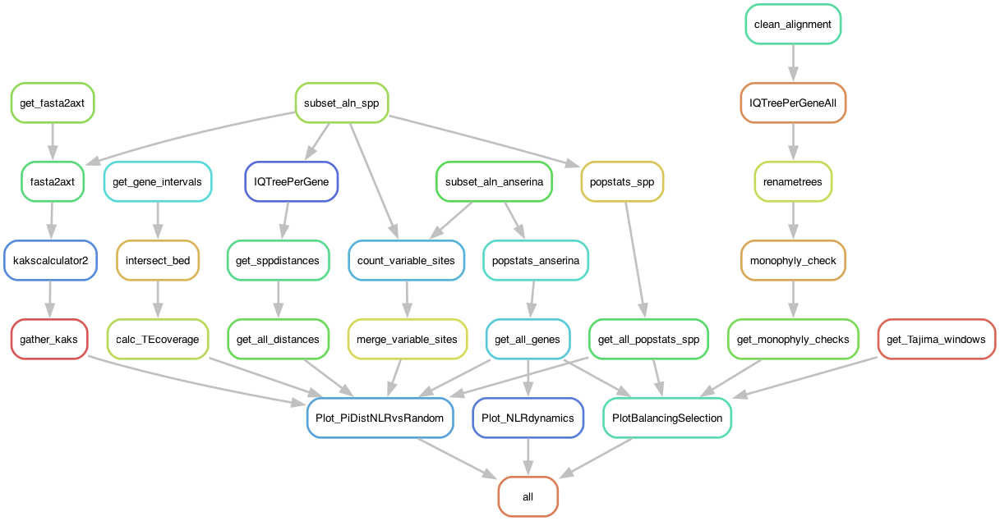

# NLRvsRandomGenes - A pipeline to compare NLRs from randomly selected genes in the *Podospora anserina* species complex

**Last update: 2025-09-23**

TODO:

- Add the alignment files
- Clean the config file
- Remove the local paths in the Rscripts

I manually produced alignments of a set of NLRs in *P. anserina* and related species, as well as randomly selected genes. In this pipeline I try to get some numbers to compare their dynamics, under the expectation that NLRs evolve faster and under a birth-death dynamic.

The pipeline is not computationally demanding, so I ran it locally on a MacOS.

# Input files

All the input files should be specified in a configuration file in yaml format, called `config/config.yaml`. The involved files are as follows:

- There are three files with a list of genes IDs (in a single column), each for the three kinds of genes: HIC NLRs, LIC NLRs and random genes. these are all available in the `data` folder.

- A csv file with the different classifications of conservation state per gene and per species, called `EvolutionAllGenes.csv` also in `data`.

- The path of a folder contaning three other folders, each with the alignments in fasta format of each NLR and random gene: 
	- Folder `nlrs` contains the LIC NLRs.
	- Folder `nlrsHIC` contains the HIC NLRs.
	- folder `random` contains the randomly selected genes.

Each gene has a full alignment including introns, and another with only the coding sequences (CDS). The HIC NLRs also include alignments with the HIC repeats removed except for the first one (`noHICrepts`) or the full sensor domain removed till the stop codon (`_noReptDomain`).

- A bed file of the regions that match 5 Kbp windows (overlapping, steps of 1 Kbp) with Tajima's D >= 2 in the Wageningen population of *Podospora anserina*, from [Ament-Velásquez et al. (2022) NEE](https://doi.org/10.1038/s41559-022-01734-x). This file is to calculate enrichment of particular domains, but it wasn't used in the paper.

- The manually curated annotation file `data/Podan2.nice-3.02.gff3`. The gene IDs in the list of genes correspond to this file.

- The assembly Podan2, corresponding to the second iteration of the reference genome of the strain S+ ([Espagne et al. 2008](https://genomebiology.biomedcentral.com/articles/10.1186/gb-2008-9-5-r77)), produced by JGI's Mycocosm. The sequence seems to be identical to the latest version Podan3, but the newest annotation in JGI discarded the original gene codes (e.g., Pa_Z_XXXX, where Z is the chromosome and XXXX is the gene number) that the community has been using since 2008. It's available [here](https://github.com/johannessonlab/HetVPaper/blob/master/SNPpop/data/Podan2/Podan2_AssemblyScaffoldsmt.fa) and in the legacy websites of JGI. There is a [newer version of the S+ reference genome](https://doi.org/10.1186/s12864-022-09085-4), but using this version allows full compatibility with out previous work.

- The annotation (in gff3 format) of the transposable elements (from [Ament-Velásquez et al. 2024](https://doi.org/10.1093/gbe/evae034)), produced with RepeatMasker using the library PodoTE-1.00 ([Vogan et al. 2021](https://genome.cshlp.org/content/31/5/789)), available [here](https://datadryad.org/dataset/doi:10.5061/dryad.1vhhmgr0j). The file is called `Podan2.repeatmasker.gff3`.

- The size of the flanks of each gene to calculate the TE coverage (`winsize`). In the paper I used `winsize: 2000`.

- Several ploting scripts in the `scripts` folder: 
	* `NLRdynamics.R`
	* `PiDistNLRvsRandom.R`
	* `PlotBalancingSelection.R`

The pipeline will automatically download my script `fasta2axt.py` to format the alignments into the input format (axn) for kakscalculator.

# Environment

At the time of working some conda packages (egglib, really) were not available on the channels for M1 architectures (the Macbook chip) so I had to use `CONDA_SUBDIR=osx-64` before calling mamba. But this won't be necessary for you if you are working on Linux!

Because I'm a rebel, I had to remove the strict channel priority for this to work.

	% conda config --set channel_priority true

Make the environment:

	% CONDA_SUBDIR=osx-64 mamba create -n nlrstats -c bioconda snakemake-minimal=7.32.4 biopython=1.85 bedtools=2.31.1 pandas=2.3.2 iqtree=3.0.1 conda-forge::ete3=3.1.3 gffutils=0.13 wget=1.21.4 egglib=3.1.0 kakscalculator2=2.0.1

The R scripts used within the pipeline have their own mini environment. However, when running conda, it will try to use normal mamba, without `CONDA_SUBDIR=osx-64`. So it will throw an error about the environment folder already existing. This is a [bug](https://github.com/mamba-org/mamba/issues/2736) associated to the old snakemake version. Using newer Snakemake versions at the time of writing was not an option because of conflicts with the other packages. But there is a workaround below.

(After you're done running the pipeline, put the channel priority back as strict.)

	% conda config --set channel_priority strict

# Running the pipeline locally

Go to working directory and activate the environment.

    % mamba activate nlrstats

First, to get an idea of how the pipeline looks like we can make a rulegraph:

	% snakemake --snakefile NLRvsRandomGenes.smk --rulegraph | dot -Tpng > rulegraph.png

To check that the files for the pipeline are in order:

	% snakemake --snakefile NLRvsRandomGenes.smk -pn

Let's run it for real:

	% snakemake --snakefile NLRvsRandomGenes.smk --use-conda -pj8

This is when the error happens. It will look like this:

	Building DAG of jobs...
	Your conda installation is not configured to use strict channel priorities. This is however crucial for having robust and correct environments (for details, see https://conda-forge.org/docs/user/tipsandtricks.html). Please consider to configure strict priorities by executing 'conda config --set channel_priority strict'.
	Creating conda environment envs/plot.yaml...
	Downloading and installing remote packages.
	CreateCondaEnvironmentException:
	Could not create conda environment from /Users/lorena/Library/CloudStorage/Dropbox/VRwork/Manuscripts/11_MolEvoINWDs/GitHub/NLRvsRandomGenes/envs/plot.yaml:
	Command:
	mamba env create --quiet --file "yourpath/GitHub/NLRvsRandomGenes/.snakemake/conda/1e2bf99ec593c0b1bf8fe0b9f3de0692_.yaml" --prefix "yourpath/GitHub/NLRvsRandomGenes/.snakemake/conda/1e2bf99ec593c0b1bf8fe0b9f3de0692_"
	Output:
	error    libmamba Non-conda folder exists at prefix
	critical libmamba Aborting.

Simply re-run the command yourself with the ID given by Snakemake in the error and `CONDA_SUBDIR=osx-64` before it:

	% CONDA_SUBDIR=osx-64 mamba env create --quiet --file "yourpath/GitHub/NLRvsRandomGenes/.snakemake/conda/1e2bf99ec593c0b1bf8fe0b9f3de0692_.yaml" --prefix "yourpath/GitHub/NLRvsRandomGenes/.snakemake/conda/1e2bf99ec593c0b1bf8fe0b9f3de0692_"
	Confirm changes: [Y/n] y

That will take some time... but now you should be able to run it for real:

	% snakemake --snakefile NLRvsRandomGenes.smk --keep-going --use-conda -pj8

## Results

The pipeline will produce a number of figures in the folder `results`.

- Figure 3: Partially, it has almost all the elements of the figure but I added the phylogeny in Inkscape
- Figure 5: Tajima's D and test of monophyly
- Figure S1: About mutations in the 3 gene classes and the RIP patterns
- Figure S2: Nucleotide diversity in non-synonymous sites and also Nucleotide diversity in synonymous sites for genes classified as conserved vs degraded.
- Figure S3: dN/dS ratios between Podospora anserina and the other Podospora species, but only for degraded genes.

The pipeline also produces additional figures that didn't make it to the paper in the folder `figures`.

