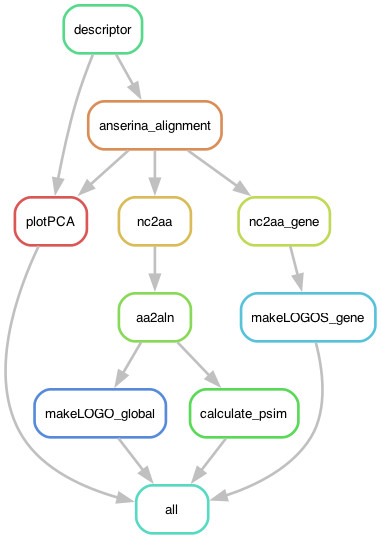

# Exploring the diversity of TPR repeats in the Podospora anserina species complex: REPEATexplorerTPRTPR.smk

Similar to the work in `wd40explorer.smk` from [Ament-Velásquez et al. (2025) Microbial Genomics](https://doi.org/10.1099/mgen.0.001442), here I explore the TPR repeats of NLR genes with high internal repeat conservation, using a regex to find them.

This is meant to be a small pipeline so I'm doing it just locally on my MacOs.

I used these paper as a reference for the alignment: 

**TPR repeats**
- Marold et al. (2015) A Naturally Occurring Repeat Protein with High Internal Sequence Identity Defines a New Class of TPR-like Proteins https://doi.org/10.1016/j.str.2015.07.022

"We identified a unique P. anserina (Pa) sequence with tetratricopeptide repeat (TPR) homology, which contains longer (42 residue) repeats (42PRs) with an average PSI >91%. (...) Compared with 34-residue TPRs (34PRs), Pa 42PRs have a one-turn extension of each helix, and bury more surface area."

## Building the environment

The pipeline depends on a [conda/mamba](https://mamba.readthedocs.io/en/latest/user_guide/mamba.html) environment. At the time of working some conda packages were not available on the channels for M1 architectures (the Macbook chip) so I had to use `CONDA_SUBDIR=osx-64` before calling mamba. But this won't be necessary for you if you are working on Linux!

	% CONDA_SUBDIR=osx-64 mamba create -n nlrs2 -c bioconda snakemake-minimal=8.14.0 biopython r-ggplot2=3.4.4 r-dplyr=1.1.4 r-ape=5.7_1 r-patchwork=1.2.0 r-adegenet=2.1.10 conda-forge::r-cowplot=1.1.3 conda-forge::r-ggseqlogo=0.2 bioconda::clustalw=2.1

## Configuration file

I harcoded the name of the expected config file to be in the working directory and named it `config.yaml`.

```yaml
# Input files
basealignment: "data/TPRs_full_CDS_nom_noemptycols.fa"

# Scripts
descriptor: "scripts/REPEATdescriptor.py"
REPEAT_LOGO: "scripts/REPEAT_LOGO.R"
REPEATS_PCA: "scripts/TPRs_PCA.R"
TPRs_LOGOS: "scripts/TPRs_LOGOS.R"

# Definition of the repeats
REGEX: '([\w])([HYD])([PT])([\w]{36})([LS])([GTSR])([KAQDE])'
REPLEN: 42
REPMINLEN: 42
REPMAXLEN: 42

# The amino acid positions used to classify the repeats (influenced by the REGEX definition of the repeat). 
AMINOS: ['1-4-5-6-7-9-10-11-14-15-16-17-18-19-21-22-23-26-27-28-29-30-31-32-33-34-35-36-37-38-39-40-41-42'] # This is not really important, ignore!
```

The AMINOS variable is not super useful here. In the [original version of the pipeline](https://github.com/SLAment/FixingHetDE/tree/main/NWDgenes) the goal is to classify the repeats using the hypervariable amino acid positions, but in this case I had no a priori knowledge of what those were. So I just use all amino acids.


## Run pipeline locally

Go to the folder where the pipeline is and activate your environment:

	% mamba activate nlrs2

First, to get an idea of how the pipeline looks like we can make a rulegraph:

	% snakemake --snakefile REPEATexplorerTPR.smk --rulegraph | dot -Tpng > rulegraph.png



To check that the files for the pipeline are in order:

	% snakemake --snakefile REPEATexplorerTPR.smk -pn

Let's run it for real:

	% snakemake --snakefile REPEATexplorerTPR.smk -pj8

Or

	% snakemake --snakefile REPEATexplorerTPR.smk -pj8 &> snakemake.log &

Something went wrong and you want to interrupt the run? Kill it!

	$ kill -s SIGINT -$PID

Where `$PID` is the process ID you get after running it with `&> snakemake.log &`.

## Results

The pipeline will make a `results` folder that contains the Figure 8 

