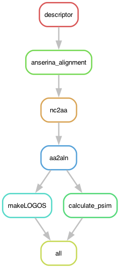

# Exploring the diversity of domain repeats in the Podospora anserina species complex: REPEATexplorer.smk

Similar to the work in `wd40explorer.smk` from [Ament-Velásquez et al. (2025) Microbial Genomics](https://doi.org/10.1099/mgen.0.001442), here I make a LOGO of the repeat domain of NLR genes with high internal repeat conservation, using their nucleotide alignment and a regex to find the individual repeat units.

This is meant to be a small pipeline so I'm doing it just locally on my MacOs. The pipeline should be independently run for each gene. So if you want to make LOGOs of all of them you must copy the content of the repo 4 times in different folders. In principle, the pipeline should work for any alignment of an HIC NLR, as long as the nucleotide alignment has the **repeat domain in frame** and you have a [REGEX](https://regex101.com/) to find the repeat unit.

I used these papers as a reference to find the repeat units: 

**HEAT repeats**
- Andrade et al. 2001 https://www.sciencedirect.com/science/article/pii/S0022283601946248
- Yoshimura & Hirano 2016 https://journals.biologists.com/jcs/article/129/21/3963/55918/HEAT-repeats-versatile-arrays-of-amphiphilic

"A single HEAT motif (∼30–40 amino acids long) is composed of a pair of α-helices (referred to as A- and B-helices) connected by a short linker. The motif is highly degenerate at the primary structure level and can only be recognized by a very loose consensus sequence (Fig. 1A) (Neuwald and Hirano, 2000)."

**ANK repeats**
- Al-Khodor et al. (2009) Functional diversity of ankyrin repeats in microbial proteins https://doi.org/10.1016/j.tim.2009.11.004
- Mosavi et al. (2009) The ankyrin repeat as molecular architecture for protein recognition https://doi.org/10.1016/j.gene.2024.148759
- Gupta & Chahota (2024) https://linkinghub.elsevier.com/retrieve/pii/S0378111924006401

"The ankyrin repeat is a 33-amino acid motif (...) The recurring segment, known as the amino acid TPLH motif occurring from the 4th to 7th amino acids, is a widely present REPEAT rep sequence and constitutes the initial α helix"

But the ones I'm finding can be longer than 33, up to 35aa.

**TPR repeats**
- Marold et al. (2015) A Naturally Occurring Repeat Protein with High Internal Sequence Identity Defines a New Class of TPR-like Proteins https://doi.org/10.1016/j.str.2015.07.022

"We identified a unique P. anserina (Pa) sequence with tetratricopeptide repeat (TPR) homology, which contains longer (42 residue) repeats (42PRs) with an average PSI >91%. (...) Compared with 34-residue TPRs (34PRs), Pa 42PRs have a one-turn extension of each helix, and bury more surface area."

## Building the environment

The pipeline depends on a [conda/mamba](https://mamba.readthedocs.io/en/latest/user_guide/mamba.html) environment. At the time of working some conda packages were not available on the channels for M1 architectures (the Macbook chip) so I had to use `CONDA_SUBDIR=osx-64` before calling mamba. But this won't be necessary for you if you are working on Linux!

	% CONDA_SUBDIR=osx-64 mamba create -n nlrs2 -c bioconda snakemake-minimal=8.14.0 biopython r-ggplot2=3.4.4 r-dplyr=1.1.4 r-ape=5.7_1 r-patchwork=1.2.0 r-adegenet=2.1.10 conda-forge::r-cowplot=1.1.3 conda-forge::r-ggseqlogo=0.2 bioconda::clustalw=2.1

## Configuration file and input files

I harcoded the name of the expected config file to be in the working directory and named `config/config.yaml`. Here is when you decide what alignment you want to run. In the `data` folder I put the alignments of all the genes used for Figure S12. Depending on the gene, you also have to change the REGEX used. Hence, in the `config` folder, I left the four configuration files used for each gene. To use them you must either change the name to `config/config.yaml` or run the pipeline with the `--configfile` argument.

The alignments are done in a certain way. The name is not important, is just for me to remember how I made it. Basically each alignment contains all the sequences of the 13 *P. anserina* strains and the other *Podospora* strains. The contain introns, but there are a few empty columns (despite the name) that I introduced such that the repeat domain is in frame. The alignments also contain the sequences of het-d/e backcrosses from [Ament-Velásquez et al. (2025) Microbial Genomics](https://doi.org/10.1099/mgen.0.001442), but those are ignored by the pipeline. 

Example used for Pa_6_7270:

```yaml
# Input files
basealignment: "data/Pa_6_7270_haplotypes_al_sanscomata_trim_reAl_noGuides_noemptycols_sansCoEcp.fa"

# Scripts
descriptor: "scripts/REPEATdescriptor.py"
REPEAT_LOGO: "scripts/REPEAT_LOGO.R"

## Variables
GENE: "Pa_6_7270"

# Definition of the repeats
REGEX: '(E|K|Q)(E|Q|G)([\w]{1})(L)(Q)([\w]{20})(L|A|F)([\w]{1})([\w]{4})(L)(P|S|L)'
REPLEN: 33
REPMINLEN: 33
REPMAXLEN: 33

# The amino acid positions used to classify the repeats (influenced by the REGEX definition of the repeat)
AMINOS: ['3-15-16-17-20-21-24-25']
```

The AMINOS variable is not super useful here. In the [original version of the pipeline](https://github.com/SLAment/FixingHetDE/tree/main/NWDgenes) the goal is to classify the repeats using the hypervariable amino acid positions, but in this case I had no a priori knowledge of what those were so I just used whatever. It's not important to make the logos.


## Run pipeline locally

Wo to the working directory containing the pipeline. Then activate the environment.

	% mamba activate nlrs2

First, assuming the configuration file is called `config/config.yaml`, to get an idea of how the pipeline looks like we can make a rulegraph:

	% snakemake --snakefile REPEATexplorer.smk --rulegraph | dot -Tpng > rulegraph.png

If not, we can explicitly say what config file we want:

	% snakemake --snakefile REPEATexplorer.smk --configfile config/config_Pa_2_8180.yaml --rulegraph | dot -Tpng > rulegraph.png



To check that the files for the pipeline are in order:

	% snakemake --snakefile REPEATexplorer.smk --configfile config/config_Pa_2_8180.yaml -pn

Let's run it for real:

	% snakemake --snakefile REPEATexplorer.smk --configfile config/config_Pa_2_8180.yaml -pj8

## Results

The pipeline will produce a LOGO figure for the repeats in the alignment. I manually put them together in Inkscape for the final figure.
