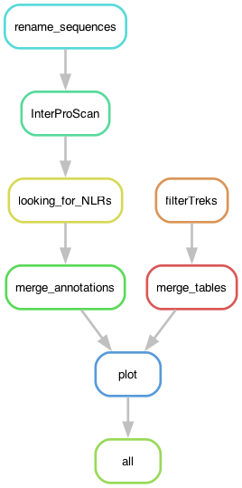

# smartHIC: Quantifying HIC repeats across the Tree of Life

Proteins with WD40, ANK, TPR, and LRR repeatd were extracted from the SMART database. The idea is to look for instances of HIC with [T-REKS](https://bioinfo.crbm.cnrs.fr/index.php?route=tools&tool=3) and report some numbers. Redundancy was removed at a cut-off of 80%.

## Building the environment

I ran this pipeline in a SLURM cluster. To create the environment I mostly use Conda, although the installation of InterProScan is independent of that environment.

	$ mamba create -n hicenv -c conda-forge -c bioconda snakemake-minimal=8.30.0 snakemake-executor-plugin-cluster-generic=1.0.9 biopython=1.85 mummer=3.23

To activate the environment: 

	$ mamba activate hicenv

I loaded the available InterProScan module as:

	$ module load interproscan/5.75-106.0

## The profile

For this pipeline I use a [profile](https://snakemake.readthedocs.io/en/stable/executing/cli.html#profiles), which has the information necessary to run the pipeline in a SLURM server. It depends on a file called `config.v8+.yaml` in the `profile` folder.

The config.yaml file contains:

```yaml
cluster-generic-submit-cmd:
  mkdir -p logs/{rule} &&
  sbatch
    --account={resources.account}
    --partition={resources.partition}
    --cpus-per-task={resources.threads}
    --mem={resources.mem_mb}
    --job-name={rule}
    --error=logs/{rule}/{rule}-{wildcards}-%j.err
    --output=logs/{rule}/{rule}-{wildcards}-%j.out
    --time={resources.time}
    --parsable
default-resources:
  - account="XXXXXXXXX"
  - partition="core"
  - time="1:00:00"
  - threads=1
  - mem_mb=2GB

restart-times: 0
max-jobs-per-second: 10
max-status-checks-per-second: 1
jobs: 100
keep-going: True
rerun-incomplete: True
printshellcmds: True
scheduler: greedy
use-conda: True
cluster-cancel: scancel # To automatically cancel all running jobs when you cancel the main Snakemake process 
cluster-cancel-nargs: 50
```

Where XXXXXXXXX is your cluster account. Replace that! Be also mindful of the name of the partitions used in your cluster and the memory given per thread.

You can run the pipeline without the profile (using `--snakefile smartHIC.smk`! But keep in mind that I designed the rules to call for resources from it. But this can be easily modified if you are a bit familiar with Snakemake.

I also used a configuration file, but that is called internally in the pipeline. It's in the `config` folder.

## Configuration file

The configuration file contains the expected names of the redundancy-reduced individual fasta files and T-REKS outputs available in the folder `data/XXX` where `XXX` is either of the four repeat types, ANK, LRR, TPR, or WD40.

For example, for the taxon `Actinobacteria` the pipeline expects the files `data/XXX/Treks_Actinobacteria.txt` and `data/XXX/diamond_deepclust_Actinobacteria.fa`.

The file `data/PFAM_reference.txt` contains a list of PFAM domains and their assignated names.

`PSIMmin` is the minimum value of Psim, as calculated by T-REKS, to consider that a protein has HIC. The pipeline also has a hard-coded threshold to select T-REKS inferences between 21 and 100 bp, which corresponds to a lower end for the LRR repeat, and a situation with double repeats (typically around 84bp) identified as a unit.

```yaml
### Configuration file of smartHIC: Quantifying HIC repeats across the Tree of Life
# ===========================================================================
# Sandra Lorena Ament Velasquez
# 2025-08-27
# ++++++++++++++++++++++++++++++++++++++++++++++

# Parameters

TAXA: ["Actinobacteria", "Archaea", "Ascomycetes", "Bacteroidota", "Basidiomycetes", "Chloroflexi", "Cyanobacteria", "Metazoa", "OtherEukaryotes", "OtherFungi", "Planctomycetes", "Proteobacteria", "Verrucomicrobia", "Viridiplantae"]
path2files: "data/"

# Reference file of Pfams
PFAMref: "data/PFAM_reference.txt"

repeat_types: ["WD40", "ANK", "TPR", "LRR"]

PSIMmin: 0.70

# Scripts
HICinSMART: "scripts/HICinSMART.R"

```

# Running the pipeline

Go to working directory.

	$ cd /path/2/HICproteins

Load the environment and the path to your profile if different from `profile/config.v8+.yaml`

	$ mamba activate hicenv
	$ export SNAKEMAKE_PROFILE='path/to/profile/'

First, to get an idea of how the pipeline looks like we can make a rulegraph:

	$ snakemake --snakefile smartHIC.smk --rulegraph | dot -Tpng > rulegraph.png



To check that the files for the pipeline are in order:

	$ snakemake --snakefile smartHIC.smk -pn

In a SLURM cluster, I like to make a screen, in case you get disconnected. 

	$ screen -R IPS 
	$ mamba activate hicenv
	$ export SNAKEMAKE_PROFILE='path/to/profile/'
	$ module load interproscan/5.75-106.0
	$ snakemake --snakefile smartHIC.smk --keep-going &> snakemake.log &


### Results

In the end, the pipeline should produce three plots:

- AllvsHICproteins_propotions.png - Figure 9 in the main manuscript
- AllvsHICproteins_totals.png - Figure S14
- Barplot_HICproteins_propotions.png - Figure S13

